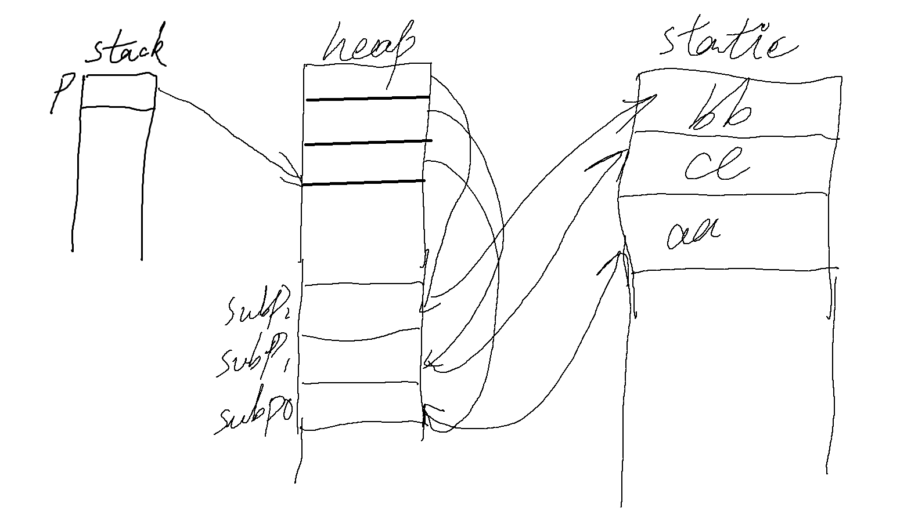

## 基础数据类型

```c
int b[10];
printf("b=%d, b+1=%d, &b=%d, &b+1=%d\n", b, b+1, &b, &b+1);
```

以上 b 是数组首元素地址，&b 是整个数组得地址


## 一级指针

```c
  #include <stdio.h>
  #include <stdlib.h>
  #include <string.h>
  
  int main()
  {
      char buf[20] = "aaaa";
      char buf2[] = "bbbb";
      char *p = "aaaa";
      char *p1 = (char *)malloc(100);
      strcpy(p1, "126836");
  
      printf("buf = %X, p = %X\n", buf, p);
  
      return 0;
  }
```

- 上面这段代码 buf 和 p 得输出是不一样得，因为 buf 是在栈上分配得内存，然后把 aaaa 得值拷贝到 buf，而 p 是指向一个常量区得 aaaa 得地址

- 一般在被调函数中使用辅助变量接收形参得值做操作，不轻易改变形参
- 一般使用指针作为形参作为输出参数


```c
  #include <stdio.h>
  #include <string.h>
  #include <stdlib.h>
  
  int main(int argc, char** argv)
  {
      const int a = 2;
      printf("a = %d\n", a);
  
      char* p = NULL;
      p = &a;
      *p = 3;
      printf("a = %d\n", a)
  
      return 0;
  }
```

- 以上这段代码，a 是使用 const 修饰的，但是可以通过 a 的地址间接修改 a 的值


## 二级指针

- 当使用一级指针得地址作为实参传给被调用函数得时候，被调用函数得形参需要为二级指针

- 函数参数有输入和输出特性

- int buf[10];  buf 本质是一个常量指针，就是说不能给它赋值


### 内存模型1

指针数组

```c
char* buf[] = {"aa", "cc", "bb"};
```


### 内存模型2

二维数组

```c
char buf[10][20] = {"aa", "cc", "bb"};
```

这种内存模型和第一种的区别是指针所指向的内存的数据类型不一样，导致步长不一样


### 内存模型3

```c
int num = 3;
char** p = NULL;
p = (char*)malloc(sizeof(char*) * num);
char* subP0 = (char*)malloc(sizeof(char) * 20);
strcpy(subP0, "aa");
p[0] = subP0;
char* subP1 = (char*)malloc(sizeof(char) * 20);
strcpy(subP1, "cc");
p[1] = subP1;
char* subP2 = (char*)malloc(sizeof(char) * 20);
strcpy(subP2, "bb");
p[2] = subP2;

// do something

free(subP0);
free(subP1);
free(subP2);
free(p);
```

